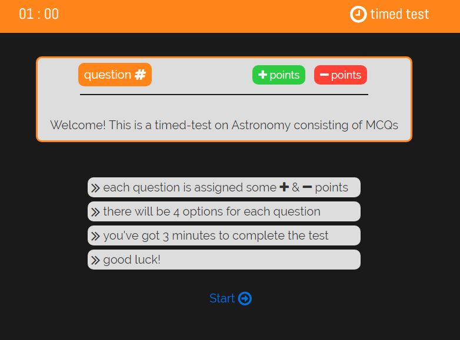
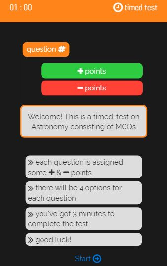

# Timed test

This is a timed test web app on Astronomy consisting of MCQs which displays points earned in a tabular form at the end of test. Following are the 2 views/designs of this web app:

1. Desktop view
  
2. Mobile view
  
[View app](https://apooravc.github.io/ReactJS-works/works/timed-test/index.html)

## Installing

1. Clone the repository [ReactJS-works](https://github.com/apooravc/ReactJS-works).
2. Open works/timed-test/index.html in the browser.

